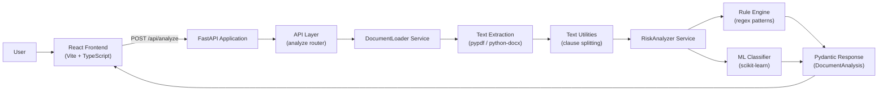

# 🛡️ NitiCheck

**AI-Powered Document Risk Analyzer for Financial Policies**

NitiCheck is an intelligent document analysis platform that helps users **understand hidden risks, unfair clauses, and complex terms** in documents by converting dense policy language into **clear, actionable insights**.

Built with a modern full-stack architecture, NitiCheck currently focuses on **financial documents** and is designed to scale seamlessly to **legal and medical documents** in future iterations.

---

## Table of Contents

- [Why NitiCheck?](#-why-niticheck)
- [Features](#-features)
- [Risk Types Detected](#-risk-types-detected-current)
- [Tech Stack](#-tech-stack)
- [System Architecture](#-system-architecture)
- [Backend Folder Structure](#-backend-folder-structure)
- [Design Decisions](#-design-decisions)
- [API Reference](#-api-reference)
- [Local Setup](#-local-setup)
- [Security & Privacy](#-security--privacy)
- [Scalability & Future Improvements](#-scalability--future-improvements)
- [Screenshots](#-screenshots)
- [Author](#-author)
- [License](#-license)

---

## 🚀 Why NitiCheck?

Most people blindly accept:

- Loan agreements
- Insurance policies
- Terms & Conditions
- Subscription contracts

…because they’re **long, complex, and intimidating**.

NitiCheck solves this by:

- Detecting **risky or unfavorable clauses**
- Explaining them in **plain language**
- Assigning **risk levels** for quick understanding
- Giving users clarity **before they sign**

---

## ✨ Features

### Document Processing

- Upload **PDF** or **DOCX** documents (backend); web UI currently exposes PDF upload
- Text extraction via **pypdf** / **PyPDF2** (PDF) and **python-docx** (DOCX, including table content)
- Automatic clause segmentation using paragraph and sentence boundaries
- File validation (type, size up to 10 MB, minimum extractable text)

### Risk Analysis

- **Rule-based** keyword and regex pattern matching across eight financial risk categories
- Numeric threshold checks (e.g., interest rates above 18%)
- **Hybrid ML boost** — scikit-learn classifier augments rule-based severity when confidence is high
- Severity classification: **Low**, **Medium**, **High**
- Plain-language explanations generated per identified clause

### User Experience

- Drag-and-drop document upload with loading states
- Interactive clause viewer sorted by severity
- Expandable plain-language explanations per clause
- Visual **risk summary** with overall score, severity breakdown, and category counts
- Educational disclaimer footer

### Security & Privacy

- **In-memory** document processing — no disk persistence
- No database or cloud storage of uploaded files
- Documents processed only for the duration of a single API request

---

## 🧠 Risk Types Detected (Current)

| Category | Default Severity |
|----------|------------------|
| High Interest Rate | High |
| Hidden Fees | Medium |
| Penalty Clauses | High |
| Auto-Renewal | Medium |
| One-Sided Termination | High |
| Arbitration Clause | Low |
| Variable Interest Rate | Medium |
| Prepayment Penalty | Medium |

Additional **ML Detected Risk** entries may appear when the classifier model flags high-confidence risks not matched by rules.

---

## 🧰 Tech Stack

### Frontend

| Technology | Purpose |
|------------|---------|
| React 18 + TypeScript | UI framework and type safety |
| Vite | Dev server and build tooling |
| Tailwind CSS | Utility-first styling |
| shadcn/ui (Radix UI) | Accessible component library |
| React Router | Client-side routing |
| TanStack React Query | Async state management |
| Lucide React | Icons |

### Backend

| Technology | Purpose |
|------------|---------|
| FastAPI | REST API framework |
| Uvicorn | ASGI server |
| Pydantic v2 | Request/response validation |
| python-multipart | File upload handling |

### AI/ML

| Technology | Purpose |
|------------|---------|
| scikit-learn | Clause risk classification |
| joblib | Serialized model loading (`risk_classifier.pkl`) |

> The ML model is loaded from `backend/app/models/risk_classifier.pkl` at startup. If the file is absent, analysis continues using rule-based detection only.

### Document Processing

| Technology | Purpose |
|------------|---------|
| pypdf | Primary PDF text extraction |
| PyPDF2 | Fallback PDF library |
| python-docx | DOCX text and table extraction |

### Development Tools

| Technology | Purpose |
|------------|---------|
| ESLint | Frontend linting |
| TypeScript | Static typing (frontend) |
| PostCSS + Autoprefixer | CSS processing |

---

## 🏗️ System Architecture

NitiCheck follows a **layered, service-oriented** backend with a decoupled React frontend. The API is stateless — each request independently loads, extracts, analyzes, and returns results without persisting document data.



**Request flow:**

1. User uploads a document through the React frontend.
2. FastAPI validates file type and size, then passes the upload to `DocumentLoader`.
3. Extracted text is split into clause segments via `text_cleaner` utilities.
4. `RiskAnalyzer` evaluates each clause using regex-based rules and optional ML predictions.
5. Structured results (`DocumentAnalysis` with `Clause` objects) are returned as JSON.

---

## 📁 Backend Folder Structure

```
backend/
├── app/
│   ├── api/              # HTTP route handlers (thin controllers)
│   │   └── analyze.py    # POST /api/analyze endpoint
│   ├── services/         # Business logic layer
│   │   ├── document_loader.py   # PDF/DOCX text extraction
│   │   ├── risk_analyzer.py     # Rule engine + ML hybrid analysis
│   │   └── ml_classifier.py     # scikit-learn model wrapper
│   ├── models/           # Pydantic schemas + optional ML artifact
│   │   └── schemas.py    # Clause, DocumentAnalysis models
│   ├── core/             # Application configuration
│   │   └── config.py     # CORS, file limits, API prefix
│   ├── utils/            # Shared helpers
│   │   └── text_cleaner.py      # Text normalization, clause splitting
│   └── main.py           # FastAPI app entry point
├── requirements.txt
└── test_ml.py            # ML classifier smoke test
```

### Architectural Principles

Separating **routes**, **services**, **models**, **config**, and **utilities** keeps each layer focused on a single responsibility. API handlers stay thin; analysis logic lives in testable service modules; Pydantic schemas enforce contracts between backend and frontend. This structure makes it straightforward to add new risk patterns, document formats, or endpoints without touching unrelated code.

---

## 💡 Design Decisions

| Decision | Rationale |
|----------|-----------|
| **FastAPI** | Native async support, automatic OpenAPI docs, and Pydantic integration for typed request/response validation with minimal boilerplate. |
| **React + Vite** | Fast HMR during development, modern ES module bundling, and a component-driven UI that maps cleanly to the analysis workflow. |
| **Modular services** | `DocumentLoader`, `RiskAnalyzer`, and `MLClauseClassifier` are independent modules — each can be tested, replaced, or extended in isolation. |
| **Rule-based analysis** | Transparent, auditable risk detection with configurable keyword patterns and numeric thresholds; no external API dependency for core analysis. |
| **ML classifier** | Adds a second signal for high-confidence risk detection and severity boosting; gracefully degrades when the model file is unavailable. |
| **In-memory processing** | Documents never touch disk or a database — aligned with a privacy-first design and simplified deployment for a single-request analysis pipeline. |

---

## 📡 API Reference

Base URL (local): `http://localhost:8000`

| Method | Endpoint | Description |
|--------|----------|-------------|
| `GET` | `/` | API status and version info |
| `GET` | `/health` | Health check |
| `POST` | `/api/analyze` | Upload a document and return structured risk analysis |

### `POST /api/analyze`

**Request:** `multipart/form-data` with a `file` field (`.pdf` or `.docx`, max 10 MB)

**Response:** `200 OK`

```json
{
  "clauses": [
    {
      "clause_id": "uuid",
      "text": "Clause excerpt (up to 500 chars)",
      "risk_type": "High Interest Rate",
      "severity": "High",
      "explanation": "Interest rate 24.0% exceeds safe threshold of 18.0%."
    }
  ]
}
```

**Error responses:** `400` (validation / extraction failure), `500` (processing error)

Interactive API docs available at `http://localhost:8000/docs` when the backend is running.

---

## 🛠️ Local Setup

### Prerequisites

- **Python** 3.10+
- **Node.js** 18+ and npm

### 1. Clone the repository

```bash
git clone https://github.com/<abhi-la-sha>/NitiCheck.git
cd NitiCheck
```

### 2. Backend setup

```bash
cd backend

# Create and activate virtual environment
python -m venv venv

# Windows
venv\Scripts\activate

# macOS / Linux
source venv/bin/activate

# Install dependencies
pip install -r requirements.txt

# Start the FastAPI server
uvicorn app.main:app --reload --host 0.0.0.0 --port 8000
```

Backend runs at **http://localhost:8000**.

### 3. Frontend setup

Open a new terminal:

```bash
cd frontend

# Install dependencies
npm install

# Start the development server
npm run dev
```

Frontend runs at **http://localhost:8080** (configured in `vite.config.ts`).

Optional: set `VITE_API_URL` in `frontend/.env` if the backend runs on a different host or port (defaults to `http://localhost:8000`).

### 4. Verify

1. Open **http://localhost:8080** in your browser.
2. Upload a PDF financial document.
3. Review identified clauses and the risk summary panel.

---

## 🔐 Security & Privacy

- **In-memory processing** — uploaded files are read into memory, analyzed, and discarded within the request lifecycle.
- **No persistent storage** — no database, filesystem writes, or cloud uploads for user documents.
- **Privacy-first design** — document content is not sent to third-party services; analysis runs entirely on your deployed backend.
- **Input validation** — file type, size (10 MB cap), and minimum text length checks before analysis.
- **CORS** — restricted to configured local development origins.

> **Note:** This tool provides educational analysis only. See the in-app disclaimer — it is not a substitute for professional financial or legal advice.

---

## 🛣️ Scalability & Future Improvements

Architectural properties that support growth:

| Area | Current State | Future Direction |
|------|---------------|------------------|
| Service layer | Modular `services/` package | Add new analyzers per domain (legal, medical) |
| API design | Stateless REST endpoints | Horizontally scalable behind a load balancer |
| Risk rules | Configurable pattern dictionary | Extend `RISK_PATTERNS` for new clause types |
| ML pipeline | Optional local classifier | Retrain or swap models via joblib artifact |
| Persistence | None (by design) | Optional database for audit logs or user history |
| Processing | Synchronous per request | Background task queue for large documents |
| Frontend upload | PDF in UI; DOCX via API | Extend UI to accept DOCX |
| Analysis depth | Rule + ML hybrid | LLM-assisted reasoning (roadmap) |
| Localization | English only | Multi-language support (roadmap) |

---

<!-- ## 📸 Screenshots


| Upload Screen | Analysis Results |
|:-------------:|:----------------:|
|  |  |

| Risk Summary | Clause Detail |
|:------------:|:-------------:|
|  |  | -->

---

## 👩‍💻 Author

**Abhilasha Kamal**

---

## License

This project is licensed under the **MIT License** — see [LICENSE](LICENSE) for details.
